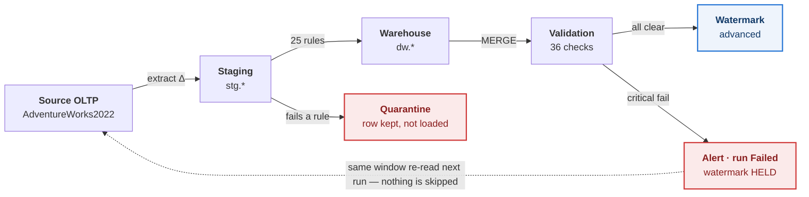
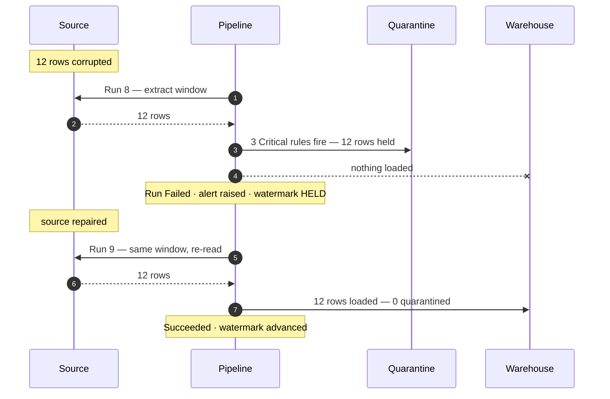

# Pipeline Dashboard

Measured results from a scheduled, self-validating ETL pipeline moving
`Sales.SalesOrderHeader` and `Sales.SalesOrderDetail` from **AdventureWorks2022**
into a SQL Server 2022 reporting warehouse.

Every figure on this page was read out of the pipeline's own run log
(`etl.etl_run_log`, `etl.etl_validation_log`, `etl.etl_run_entity`) after
executing against a live database. Nothing here is estimated. Regenerate with
`python -m etl.metrics --write`.

> SQL Server 2022 (16.0.4265.3, Developer Edition) · AdventureWorks2022
> (31,465 orders / 121,317 order lines)

---

## Headline

| | Measured | |
|---|---:|---|
| **Runs completed** | **9** | 8 succeeded, 1 failed by design |
| **Completed with no human involvement** | **88.9%** | 8 of 9 runs |
| **Row-count reconciliation pass rate** | **100%** | 36 of 36 checks |
| **Unexplained row-count variance** | **0** | across the whole history |
| **Rows loaded / extracted** | **155,065 / 155,077** | 99.992% |
| **Rows quarantined** | **12** | injected faults, none loaded |
| **Validation checks executed** | **324** | 321 passed, 3 caught the faults |
| **Median incremental run** | **0.45 s** | baseline full load: 152,782 rows in 73 s |

---

## How it moves



The dashed return path is the property the whole design rests on. Because the
watermark only advances **after** validation passes, a failed run re-reads its own
window on the next attempt. That turns a failure from data loss into a delay.

---

## Rows per incremental run

The one-time baseline full load (152,782 rows, 73 s) is listed separately — on the
same scale as a 12-row batch it would flatten everything else to nothing.

| Run | Rows | | Outcome |
|---|---:|---|---|
| 2 | 74 | `███` | loaded |
| 3 | 229 | `████████` | loaded |
| 4 | 829 | `██████████████████████████████` | loaded |
| 5 | 70 | `███` | loaded |
| 6 | 232 | `████████` | loaded |
| 7 | 837 | `██████████████████████████████` | loaded |
| **8** | **12** | `▒` | **all 12 quarantined · 0 loaded** |
| 9 | 12 | `█` | loaded — the same 12 rows, after repair |

---

## Run ledger

| Run | Type | Extracted | Loaded | Quarantined | Checks | Failed | Seconds | Status |
|---:|---|---:|---:|---:|---:|---:|---:|---|
| 1 | Full | 152,782 | 152,782 | 0 | 36 | 0 | 73.43 | ✅ Succeeded |
| 2 | Incremental | 74 | 74 | 0 | 36 | 0 | 0.48 | ✅ Succeeded |
| 3 | Incremental | 229 | 229 | 0 | 36 | 0 | 0.45 | ✅ Succeeded |
| 4 | Incremental | 829 | 829 | 0 | 36 | 0 | 0.79 | ✅ Succeeded |
| 5 | Incremental | 70 | 70 | 0 | 36 | 0 | 0.45 | ✅ Succeeded |
| 6 | Incremental | 232 | 232 | 0 | 36 | 0 | 0.39 | ✅ Succeeded |
| 7 | Incremental | 837 | 837 | 0 | 36 | 0 | 0.83 | ✅ Succeeded |
| **8** | Incremental | 12 | **0** | **12** | 36 | **3** | 0.36 | ❌ **Failed** |
| 9 | Incremental | 12 | 12 | 0 | 36 | 0 | 0.25 | ✅ Succeeded |

`extracted` always equals `loaded + quarantined`. The pipeline asserts that identity
itself, per table, on every run — which is what makes reconciliation exact rather
than approximate.

---

## The incident

A data-quality layer that has never rejected anything is an untested claim. So
twelve rows were deliberately corrupted at the source and the pipeline was left to
find them.



| Rule that caught it | Type | Entity | Rows held |
|---|---|---|---:|
| `DATE_DueBeforeOrder` | DomainCheck | SalesOrderHeader | 4 |
| `DATE_ShipBeforeOrder` | DomainCheck | SalesOrderHeader | 4 |
| `NEG_Amounts` | DomainCheck | SalesOrderHeader | 4 |

**Verified end to end:** all 12 rows quarantined with the full row preserved as JSON,
**zero** faulty rows in the warehouse, one alert raised and delivered, the watermark
held, and run 9 recovering with no replay and no backfill.

AdventureWorks will not accept these faults on its own — its CHECK constraints reject
all three. The harness disables them for the injection and re-enables them
`WITH CHECK` afterwards, simulating a source with weaker guarantees than this one:
a legacy system, a third-party feed, a replica loaded in bulk.

---

## What these numbers do **not** claim

Stated up front, because a dashboard is exactly where an unearned number would hide.

| | |
|---|---|
| **No manual-process baseline exists** | The manual export-and-load this replaces was never performed or timed, so no "reduced manual effort by N%" figure can honestly be derived — and none is reported. `etl/metrics.py` has no code path that can produce one. |
| **99.992% is completeness, not semantic accuracy** | It means every extracted row was either loaded or deliberately quarantined. Verifying semantic correctness would need a reference dataset to compare the warehouse against; no such comparison was made. |
| **Azure Data Factory was never deployed** | The ADF pipelines, Logic App, Monitor rules and Bicep templates are written against the documented 2024 API versions and call the same stored procedures these runs exercised — but every measured run was driven by the local Python runner. |
| **There is no SSIS here** | The scope permitted either SSIS or an ADF-native build. This is ADF-native: no `.dtsx`, no SSIS Integration Runtime, no SSIS claim. |
| **Arrival patterns are simulated** | AdventureWorks is static, so order activity between runs was generated against the **source** and discovered by the pipeline through its own watermark. The rows are real rows that really moved; what is synthetic is the timing, not the processing. |

Full methodology: [`docs/metrics-methodology.md`](docs/metrics-methodology.md).

---

## Reproduce it

```bash
docker compose up -d
./scripts/restore_adventureworks.sh
./scripts/deploy_schema.sh
./scripts/reset_warehouse.sh --yes

python scripts/run_experiment.py --nights 6 --fault-count 4
python -m etl.metrics --write
```

`run_experiment.py` asserts rather than reports — every source row accounted for,
injected faults quarantined, no faulty row in the warehouse, an alert raised, the
watermark held on failure, and the next run recovering unaided. It exits non-zero if
any of that fails to hold.

Row counts will differ by a few rows between runs: the simulator picks products and
customers with `NEWID()` ordering, so the number of lines per order varies. The
properties being asserted do not.

---

<sub>A richer version of this page — with proper charts and both light and dark themes —
is live at <a href="https://sreejavuyyala.github.io/etl-data-automation-pipeline/">https://sreejavuyyala.github.io/etl-data-automation-pipeline/</a>, served from
<a href="docs/index.html"><code>docs/index.html</code></a>.</sub>
